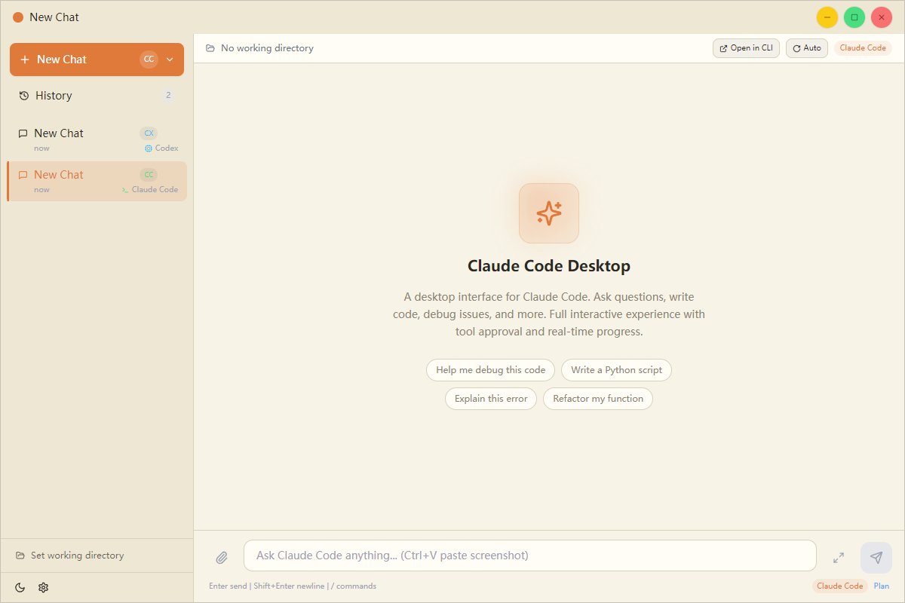

# CmdDeck

CmdDeck is a desktop UI for Claude Code and Codex CLI.

It keeps the CLI workflow, but adds:

- chat-style sessions
- local session history
- resume/open in external CLI
- file attachments
- theme and per-chat model/mode settings
- simple auto-run helpers

## Status

- Current releases are for Windows only.
- The project is developed and tested on Windows.
- macOS and Linux are not tested yet.
- Claude Code and Codex CLI are not bundled. Users install them separately.
- Session data and settings stay on the local machine.

## Download

- Recommended GitHub asset: `CmdDeck-*-portable.zip`
- Unzip it and run the included `.exe`
- Users still need to install Claude Code or Codex CLI separately

## Development

- `npm run dev`
- `npm run build`
- `npm run build:portable:zip`
- `npm run build:installer`
